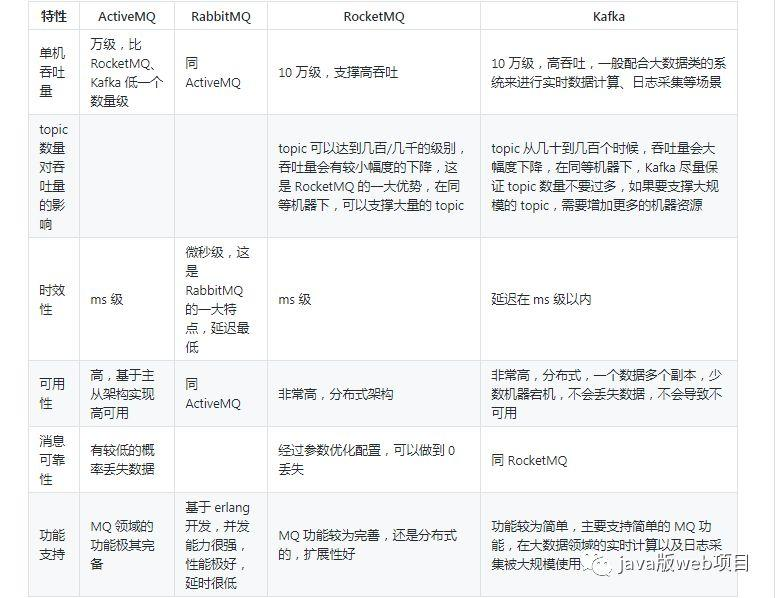
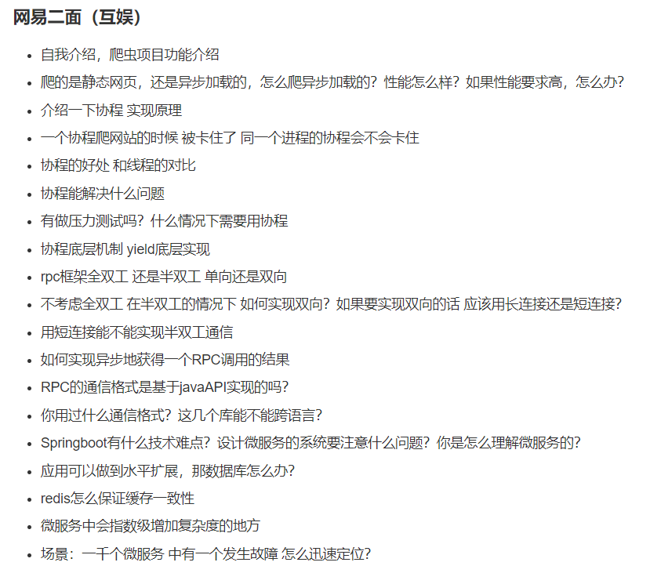
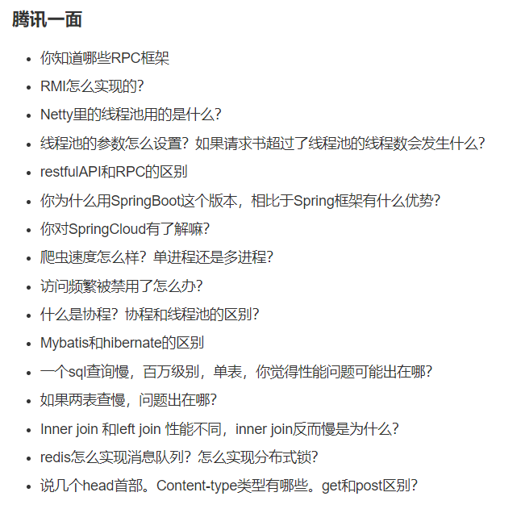
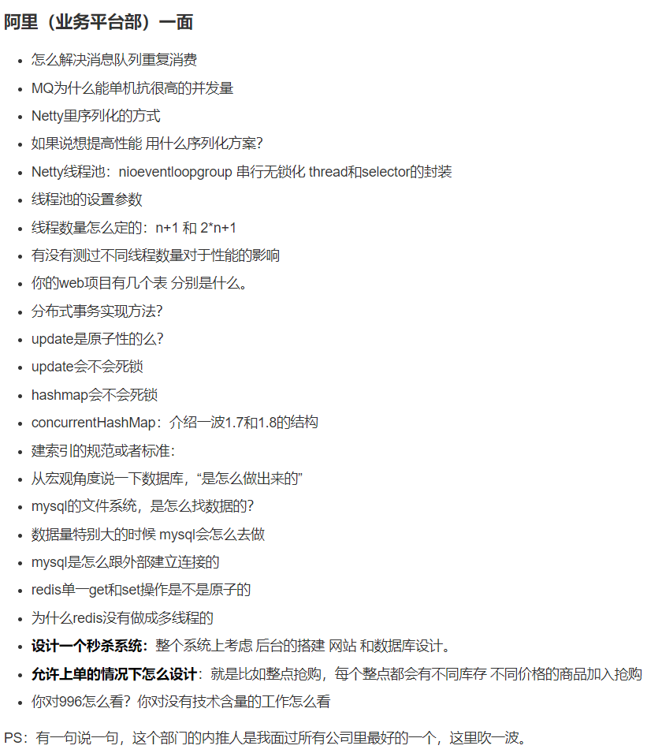
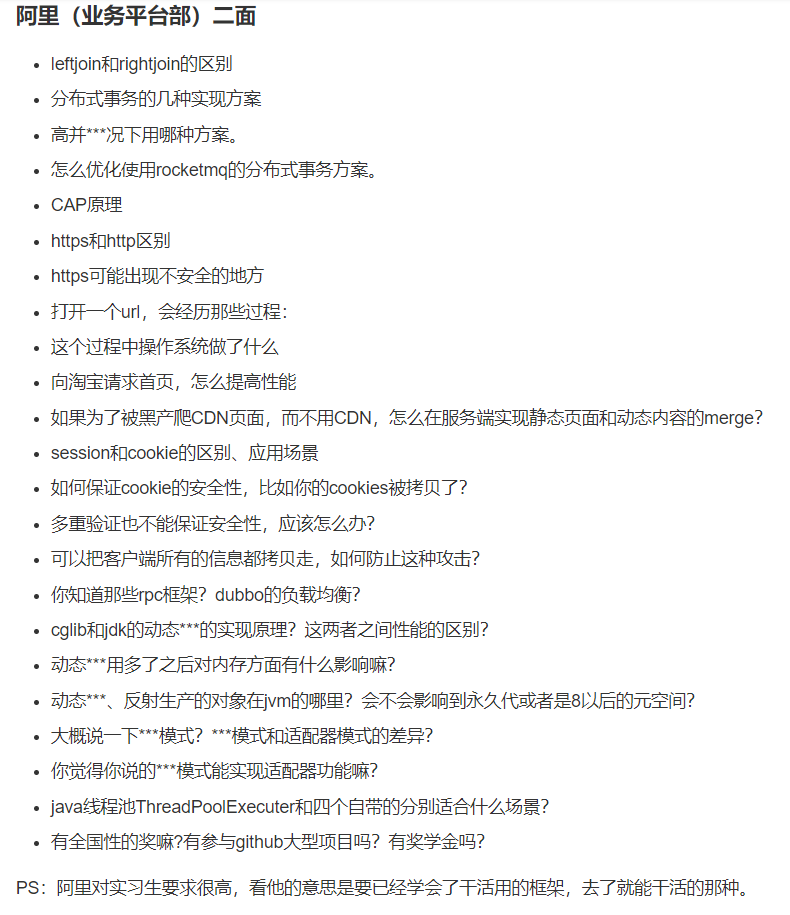
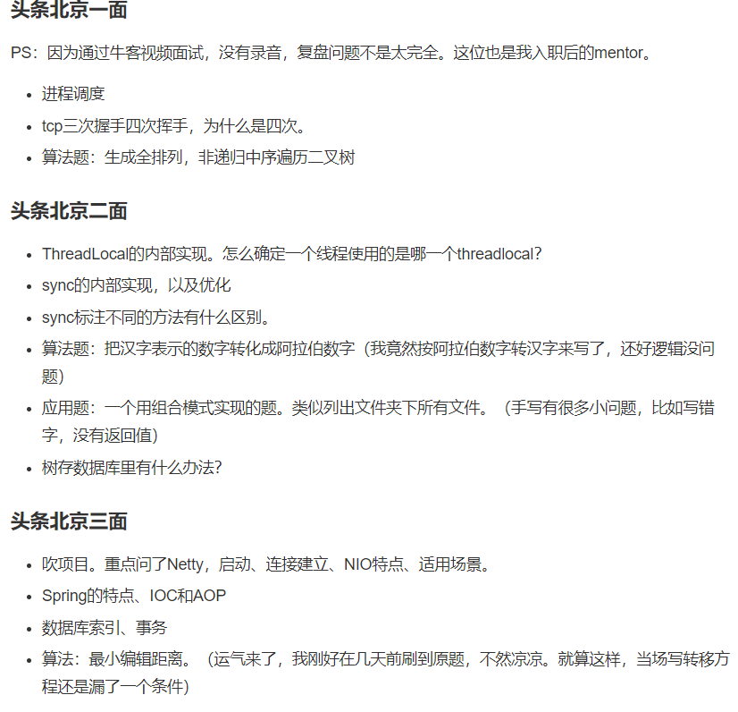
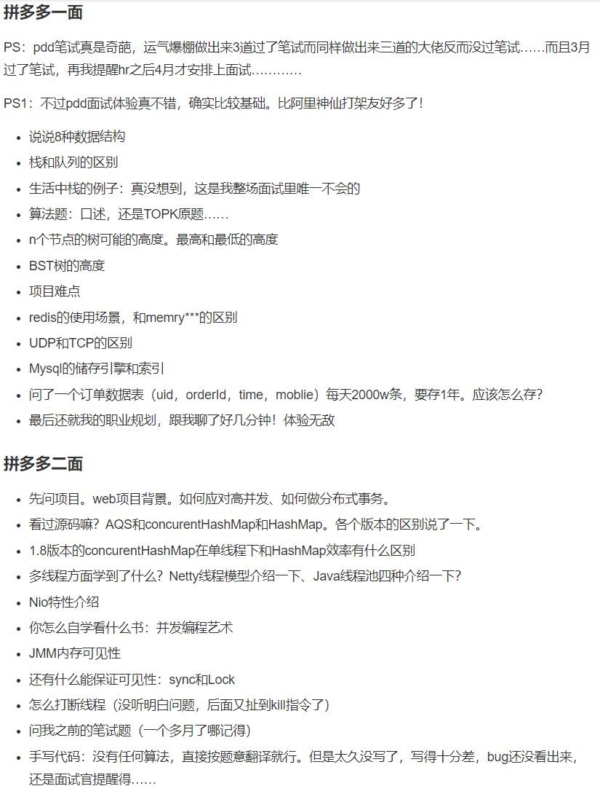

# 2019 春招面经大集合

[toc]

collabedit 写代码

## **1.算法**

- 以 O(1)时间复杂度取得最小值的栈，要求有 pop push getMin 方法
- 反转数组（代码）
- 排序的时间复杂度，空间复杂度，稳定性
- 排序的原理（快排，归并，堆）
- 散列，冲突处理方法
- 实现 LRU 算法/FIFO--[LinkedHashMap](\Container/LinkedHashMap.md#%e5%88%a9%e7%94%a8linkedhashmap%e5%ae%9e%e7%8e%b0lru%e7%bc%93%e5%ad%98)
- topk 问题思路(堆，几个 top 就扔几个进堆)
- 查找手写
- 爬虫生成的 8G 的 URL 文件，只有 1G 的内存，如何查找出重复的 URL(分布式 Hash-->一致性哈希)--==**布隆过滤器**==
- 四则运算（提示使用栈）
- 判断链表是否有环？单指针方法--判断环的入口-->==相交数组的成环问题==
- 第一题，遍历 list，并删除指定元素，（想考我 foreach 的坑，但是我没接招，使用迭代器完成，fail-fast）
- 手写死锁
- 实现优先队列

## **2.网络：**

- HTTP 方法/协议状态码
- HTTP 幂等性及 GET、POST、PUT、DELETE 的区别和有无幂等性
- HTTP 缓存机制
- [既然 HTTP 是无状态的，那服务器怎么记住上次请求的用户](https://www.cnblogs.com/cxuanBlog/p/12635842.html)
- HTTP 1.0/1.1/2.0/3.0 的区别
- http 安全问题/HTTPS 握手过程
- 幂等性设计：**大型网站技术构架 P78**
- [restful](https://www.zhihu.com/question/28557115)
- tcp 和 udp 的区别
- [TCP 怎么保证可靠传输](https://zhuanlan.zhihu.com/p/104929583)
- [TCP 协议的 TIME_WAIT 状态详解](https://blog.51cto.com/11859650/1917938)
- 三次握手，四次挥手

- TCP 协议拥塞控制
- TCP 滑动窗口
- [TCP 校验和的目的](https://www.cnblogs.com/zxiner/p/7203192.html)
- TCP/IP 模型
- OSI 的七层协议模型了解么
- [DNS 实现的机制](https://juejin.im/post/5b0a32a36fb9a07ab979f0b4)

## **3.Java 基础**

- 集合类遍历时是否可以修改---`如果我非要修改呢（CopyonWriteArrayList可以在遍历的时候修改）`[https://www.cnblogs.com/snowater/p/8024776.html]
- [StringBuilder 是怎么扩容的（默认 16，2x+2）](https://www.jianshu.com/p/100ad9b44a71)
- ArrayList 和 LinkedList 的区别
- [Java 泛型](https://juejin.im/post/6844903625722953736#heading-0)

```
泛型就是参数化类型，他相当于一个守门员，来控制什么可以放入集合，什么不可以放入，以来增加安全性，而来避免了强制类型转换。
泛型信息只存在于代码编译阶段，在进入 JVM 之前，与泛型相关的信息会被擦除掉,所以java也被称之为伪泛型。
之前泛型类中的类型参数部分如果没有指定上限，如 < T > 则会被转译成普通的 Object 类型，如果指定了上限如 < T extends String> 则类型参数就被替换成类型上限。
上界<? extends T>不能往里存，只能往外取。是编译器只知道容器内是Fruit或者它的派生类，但具体是什么类型不知道。
下界<? super T>不影响往里存，但往外取只能放在Object对象里。因为下界规定了元素的最小粒度的下限，实际上是放松了容器元素的类型控制。

```

- [如何实现 hashmap 的只读不可写，不采用其他工具](https://blog.csdn.net/codejas/article/details/78688925)
- [this 关键字--super 与 this 异同](https://www.nowcoder.com/discuss/179581)
- [main 方法中 String[] args 为什么要使用 String？main 方法的返回值为什么是 void](https://blog.csdn.net/qq_39525442/article/details/89343343)？
- [四类八种基础数据类型及其包装类](https://zhuanlan.zhihu.com/p/25439066)
- 讲一下装箱拆箱-`从反编译得到的字节码内容可以看出，在装箱的时候自动调用的是 Integer 的 valueOf(int)方法。而在拆箱的时候自动调用的是 Integer 的 intValue 方法。`
- Integer 的缓存机制
- object 的方法
- Java Collection-容器---`容器的一个接口路线，从iterator往下，两个，一个map,一个Collection，map下面的hashmap，treemap,Collection下面的list,Set。list下面的ArrayList和LinkedList,Set下面的hashSet和TreeSet等，之后再吹了一下迭代器的快速失败和安全失败`
- ※HashMap 源码级别的原理，rehash 是什么---`Hashmap的缩容，扩容机制`---`位运算的好处`---`hashmap和hashtable区别,模运算比较`---`为什么使用红黑树`
- 说一下 concrrentHashMap
- [treemap 底层数据结构，扩容，插入删除效率](https://www.jianshu.com/p/2dcff3634326)
- 链表什么时候转成红黑树，以及为什么转成红黑树；
- 异常你了解吗？有哪些
- 面向对象三大特征---`介绍多态`-==**所谓多态就是指程序中定义的引用变量所指向的具体类型和通过该引用变量发出的方法调用在编程时并不确定，而是在程序运行期间才确定，即一个引用变量倒底会指向哪个类的实例对象，该引用变量发出的方法调用到底是哪个类中实现的方法，必须在由程序运行期间才能决定**== \*\* **因为在程序运行时才确定具体的类，这样，不用修改源程序代码，就可以让引用变量绑定到各种不同的类实现上，从而导致该引用调用的具体方法随之改变，即不修改程序代码就可以改变程序运行时所绑定的具体代码，让程序可以选择多个运行状态，这就是多态性**。
  如果向上转型--子类中父类没有的，不能调用；父类有的(重写方法)会被多态绑定到子类的方法上。

```html
对于多态我们可以总结如下：
指向子类的父类引用由于向上转型了，它只能访问父类中拥有的方法和属性，而对于子类中存在而父类中不存在的方法，该引用是不能使用的，尽管是重载该方法。
若子类重写了父类中的某些方法，在调用该些方法的时候，必定是使用子类中定义的这些方法（动态连接、动态调用）。
对于面向对象，多态分为编译时多态和运行时多态。其中编译时多态是静态的，主要是指方法的重载，它是根据参数列表的不同来区分不同的函数，
通过编译之后会变成两个不同的函数，在运行时谈不上多态。而运行时多态是动态的，它是通过动态绑定来实现的，也就是我们所说的多态性。
```

- **多态的底层原理？**

JVM 的方法调用指令有四个，分别是 `invokestatic，invokespecial，invokesvirtual` 和 `invokeinterface`。前两个是静态绑定，后两个是动态绑定的。本文也可以说是对于 JVM 后两种调用实现的考察。
Java 对于方法调用动态绑定的实现主要依赖于方法表，但通过类引用调用和接口引用调用的实现则有所不同。总体而言，当某个方法被调用时，JVM 首先要查找相应的常量池，得到方法的符号引用，并查找调用类的方法表以确定该方法的直接引用，最后才真正调用该方法.

- [抽象类和接口](https://zhuanlan.zhihu.com/p/56789932)
- Java 成员变量(类变量，实例变量)---类方法和常量属性，成员属性，局部变量。
- ==StringBuilder 和 StringBuffer//String== [为什么设计成 final 不可变](https://juejin.im/post/5aa1ee0c51882555677e2109)？ 是怎么实现不可变的
- [static 用法](https://zhuanlan.zhihu.com/p/73704288)
- [内部类和静态内部类的区别]()

```
从字面上看，一个被称为静态嵌套类，一个被称为内部类。
从字面的角度解释是这样的：嵌套就是我跟你没关系，自己可以完全独立存在，但是我就想借你的壳用一下，来隐藏一下我自己。
1. 一旦内部类使用static修饰，那么此时这个内部类就升级为顶级类。
2. 静态内部类只能够访问外部类的静态成员,而非静态内部类则可以访问外部类的所有成员(方法，属性)。
3. 静态内部类不需要持有外部类的引用

什么是内部？内部就是我是你的一部分，我了解你，我知道你的全部，没有你就没有我。（所以内部类对象是以外部类对象存在为前提的）
1. 内部类可以访问其所在类的属性（包括所在类的私有属性），内部类创建自身对象需要先创建其所在类的对象。
2. 可以定义内部接口，且可以定义另外一个内部类实现这个内部接口。
3. 内部类不能定义static元素。

```

- [Java 内部类为什么能够访问外部成员变量](https://www.jianshu.com/p/3132b0641883)--[内部类能否引用外部类的 private 成员](https://www.zhihu.com/question/54730071)（**被 private 修饰的内部类只能在它所属的外部类中访问**）
- [Java 的继承有什么缺点](https://www.zhihu.com/question/20128211)
- i++线程安全吗
- equals 和 hashcode 为什么要一起重写。一个类，如果重写了 Equals(),不重写 HashCode()，会有什么问题（==重写 hashcode()，主要是针对映射相关的操作（Map 接口，依靠具体值生成 hashcode）==，仅仅重载 equals 方法可能会导致实际业务逻辑失败，确保 equals 相同 hashcode 也相同，即保证相同对象的 hashcode 一定相同
- [反射机制](https://www.jianshu.com/p/5110834f669f)( 920 P104)
- [`.Class, Class.forName, .getClass()`的区别](https://blog.csdn.net/u013160932/article/details/41861881)
- [注解是什么](https://juejin.im/post/6844903636733001741#heading-2)
  ```html
  注解本质是一个继承了 Annotation 的特殊接口，会在Java 运行时生成的动态代理类。
  我们通过反射获取注解时，返回的是运行时生成的动态代理对象。
  通过代理对象调用AnnotationInvocationHandler的invoke方法。 该方法会从
  memberValues 这个 Map 中索引出对应的值。而 memberValues的来源是 Java 常量池。
  ```
- [静态代理、动态代理和 CGLib 的区别](https://www.cnblogs.com/qlqwjy/p/7550609.html)：

```
代理模式：不改变原目标对象的前提下，通过代理对象来实现功能增强的办法。
静态代理：这种代理方式需要代理对象和目标对象实现一样的接口。由于前者，如果要代理多个对象，就会产生多个代理类。
动态代理：动态代理利用了JDK API，动态地在内存中构建代理对象，从而实现对目标对象的代理功能。
优点：动态代理对象不需要实现接口，只要求目标对象必须实现InvocationHandler，通过反射代理方法，比较消耗系统性能。

静态代理与动态代理的区别主要在：
静态代理需要自己写代理类-->代理类需要实现与目标对象相同的接口
动态代理不需要自己编写代理类--->(是通过反射动态生成的)，动态代理是在运行时动态生成的，即编译完成后没有实际的class文件，而是在运行时动态生成类字节码，并加载到JVM中。

CGlib：cglib代理无需实现接口，通过生成类字节码实现代理，比反射稍快，不存在性能问题，但cglib会继承目标对象，需要重写方法，所以目标对象不能为final类。
```

- [Java 中的 NIO](https://zhuanlan.zhihu.com/p/74117649)
- IPC 方式[进程间通信方式](https://www.jianshu.com/p/c1015f5ffa74)

### **3.1 并发**

- [详细论述几个并发容器](https://juejin.im/post/5d63c7a96fb9a06b2116f5e0)
- 多线程和 JUC 熟悉吗，我说了 AQS、ReentrantLock、线程池、CountDownLatch、CyclicBarrier
- 哪些原子性操作--JUC 下 Atomic（Ladder） 包
- 怎么实现 A、B、C 三个线程轮流打印
- submit 和 execute 的区别

```
1.对返回值的处理不同
execute方法不关心返回值。
submit方法有返回值，Future.
2.对异常的处理不同
excute方法会抛出异常。
sumbit方法不会抛出异常。除非你调用Future.get()。
```

- 什么是线程池？
- 线程池的参数？
```
core:核心线程数
max:最大线程数
workqueue:阻塞队列
keepAlive:核心线程数之外的空闲线程数
unit:单位
threadFactory: 线程工厂，这个接口里面只有有一个newThread方法。它的实现类，我们可以自定义实现任何东西。比如守护线程之类的，给线程池里面的线程初始化属性等信息。
abortpolicy:拒绝策略。

```
- 线程池的工作原理？
- 常用的线程池又那些？任务拒绝策略？如果抛出异常怎么处理
- 线程数设置多大，如果超过了最大的怎么办? 有界队列好还是无界队列好，任务非常多的时候使用什么阻塞队列能获得好的吞吐量？

```
1. 配置线程池时CPU密集型任务可以少配置线程数，大概和机器的cpu核数相当，可以使得每个线程都在执行任务
2. IO密集型时，大部分线程都阻塞，故需要多配置线程数，2*cpu核数
3. 有界队列和无界队列的配置需区分业务场景，一般情况下配置有界队列，在一些可能会有爆发性增长的情况下使用无界队列。
4. 任务非常多时，使用非阻塞队列使用cas操作替代锁可以获得好的吞吐量。
```
- 代码执行单元是？（线程）
- 是线程还是进程申请资源？（进程)
- Java 线程状态/线程池状态/操作系统进程状态
```
Java线程生命周期：
  new:线程新建
  running(reday)：线程正在运行，或者正在等待cpu分时间片
  wait：调用wait，join，sleep等方法，进入等待状态
  time_wait：等待超时，含参sleep
  block：同步，阻塞
  termined：线程死亡
线程池生命周期：
  running：线程池处理任务，并且阻塞队列接受任务
  shutdwon：线程池处理任务，阻塞队列不接受任务
  stop：全部停止
  tidying：此时有效线程为0，准备进入termined状态
  terminted：中止
```
- 各种线程池的应用场景？
- Java中如何保证线程安全？
- 多线程实现的方式？
- 进程和线程的区别？
- sleep和wait区别？
- 讲讲ThreadLocal？
- start和run方法的区别，什么方法开启？
- java的线程和操作系统的线程？
- 有时候会采用一种无锁化机制去线程同步，有哪些方案？
- [自旋锁 是公平吗？自旋锁怎么才能公平](https://blog.csdn.net/Holmofy/article/details/75213405)
- **阻塞队列以及生产者消费者的实现**
- 如何让一段程序并发执行，并最终汇总结果

```
使用CyclicBarrier 和CountDownLatch都可以
使用CyclicBarrier 在多个关口处将多个线程执行结果汇总
CountDownLatch 在各线程执行完毕后向总线程汇报结果
```

- 读多写少的场景应该是用什么并发容器，为什么使用它。

```
CopyOnWriteArrayList这个容器适用于多读少写…读写并不是在同一个对象上。
在写时会大面积复制数组，所以写的性能差，在写完成后将读的引用改为执行写的对象。
```

- 如何实现乐观锁，如何避免 ABA 问题

```
比较内存值和期望值
替换内存值为要替换值
带参数版本来避免aba问题，在读取和替换的时候进行判定版本是否一致
```

- 读写锁可以应用于什么场景

```
多读少写，读写锁支持多个读操作并发执行，写操作只能由一个线程来操作
```

- 什么时候应该用可重入锁

```
重入锁指的是在某一个线程中可以多次获得同一把锁，在线程中多次操作有锁的方法。
```

- 什么场景下可以使用 volatile 代替 synchronizd？

```
只需要保证共享资源的可见性的时候可以使用volatile替代，synchronized保证可操作的原子性一致性和可见性。
volatile适用于新值不依赖于就值的情形
```
- final 关键字底层原理，为什么做到了不可变(实际上可以使用反射改变)


### **3.2 JVM 是重点**
- Java 内存区域模型
- [为什么分堆区和栈区](https://www.zhihu.com/question/49927441/answer/118535159)
- java中变量在内存区域中存储的位置
- 四种引用类型
- [volatile 底层原理](http://xianzilei.cn/blog/60)
- 详细论述 JVM 的垃圾垃圾回收机制
- GC算法
- gcroot 对象有哪些
- 常见的垃圾回收器及他们之间区别，垃圾回收发生在哪里
- 新生代老年代大小如何划分
- JVM调优命令
- 怎么避免产生浮动垃圾([等于为什么G1没有浮动垃圾](https://www.oschina.net/question/3574106_2305713))？
- synchronized的用法，类锁和对象锁的区别
- synchronized膨胀过程和细节
- lock和synchronized区别
- volitile 关键字的理解
- synchronized和volitile的区别
- 详细论述类加载器
- 双亲委派模型 本质/用处
- 如何破坏双亲委派机制
- JVM 虚拟机启动是单线程的还是单进程的？
- 画一下 Java 的内存模型(**Java 内存模型来屏蔽掉各种硬件和操作系统的内存访问差**)
- Java原子性指令-8个指令
- 先行原则
- Java [内存泄漏如何排查排查](https://juejin.im/post/5d0ae117f265da1bc64bc7d7#heading-0)


## **数据库**
- 谈谈MySQL的读写锁
- ==[MySQL 的锁机制](https://juejin.im/post/5b82e0196fb9a019f47d1823#heading-1)==---悲观锁和乐观锁呢？悲观和乐观锁的具体实现原理呢？
- [MySQL的隔离机制](https://www.cnblogs.com/PerkinsZhu/p/6828105.html)
- [mysql 的三级封锁协议](https://blog.csdn.net/hulinku/article/details/79787692)
- 数据库三大范式
- 如何查询并解决数据库死锁
- 数据库如何避免死锁
- 什么是事务？介绍一下ACID
- MVCC 机制的实现原理
- 谈谈InnoDB和MySIAM的区别，了解Memory么
- SQL查询执行流程是什么/生命周期
- 数据库的视图
- 数据库的存储过程
- 触发器 (出发某个事件时，自动执行这些代码)-做某个表的字段监控。
- 什么是游标
- MySQL 外键删除策略（外键列全部设置为null，或者直接删除）
- SQL 语句 exist 和 in 的区别
- 组合索引吗？怎么实现的？
---
<font size=6>**基本类型**</font>

- VARCHAR和CHAR的区别？
- DATETIME和TIMESTAMP的区别？
- 数据类型有哪些优化策略？(更小的通常更好/尽可能简单/尽量避免NULL，null不会使索引，索引统计和值比较都更复杂)
---
<font size=6>**索引**</font>

- 索引有那些？
- 索引有什么作用？
- [以 B tree 和 B+ tree 的区别来分析 mysql 索引实现](https://www.jianshu.com/p/0371c9569736)
- 了解hash索引么？
- 什么是自适应哈希索引？
- 什么是空间索引？(MySIMA支持，存储地理数据。MySQL支持不完善)
- 什么是全文索引？(MySIAM的基于相似度的查询，非精确比较)
- 聚簇索引和非聚簇索引
- 什么是覆盖索引？以及为什么要使用索引(除了加快速度)
- 那些索引使用原则？（1.建立索引 2.对于比较长的列，使用前缀索引缺点是不能做分组和排序和覆盖索引 3. 合适的索引顺序 4.删除我用索引）
- 索引失效有那些？（1. 隐式类型转换 2. OR 3.LIKE 4.多个范围条件查询，第一个范围列之后的其他索引无法使用，等值查询没有限制 5. 优化器认为全局扫描比索引更快）
- 除开使用 B+ 树实现的索引，还了解其他数据结构实现的索引吗--[为什么不使用 AVL/红黑树](https://www.cnblogs.com/aspirant/p/9214485.html)(920P64)

---
<font size=6>**优化**</font>

- 如何定位低效SQL？（1. 慢查询日志定位已经执行完毕的SQL。2.使用show processlist查询当前正在执行的线程的低效sql。 找到sql通过show profile、explain或trace继续优化）
- show profile的作用。(分析sql性能消耗，例如执行多少时间，显示cpu内存使用率，花费时间等)
- trace的作用？(通过trace文件进一步获取优化器是如何选择执行计划的，需要手动打开设置，然后执行一次sql，最后查看 information_schema.optimizer_trace表的内容。)
- [Explain 有什么用，字段有哪些，代表什么意思](https://juejin.im/post/6844904163969630221?utm_source=gold_browser_extension)
- 有哪些优化SQL策略？
- [大表优化](https://www.zhihu.com/question/19719997)
- [怎么优化 mysql，mysql 性能分析工具](https://www.kaimingwan.com/post/shu-ju-ku/mysqlxing-neng-fen-xi-fang-fa-gong-ju-jing-yan-zong-jie)---`mysql的查询优化，用explain查询是否用到了索引`
- [慢查询日志以及配合 explain 及逆行慢查询优化和分析](https://juejin.im/post/5e108a55f265da5d5537fe11#heading-14)
- mysql cpu 过高怎么排查呀（不会，面试官说可以用 error log 看下）
- 关心过业务系统里面的sql耗时吗？统计过慢查询吗？对慢查询都怎么优化过？
- 如果要存储用户的密码散列，应该使用什么字段进行存储？
密码散列，盐，用户身份证号等固定长度的字符串应该使用char而不是varchar来存储，这样可以节省空间且提高检索效率。

---
<font size=6>**主从**</font>

- redolog和binlog是什么？
- [事务的二段提交](https://www.jianshu.com/p/765b5a3dac15)
- 主从复制是什么？
- 主从复制的作用？
- 数据库的热备份和冷备份？

---
<font size=6>SQL</font>
- 姓名、科目、成绩，写 sql 语句统计总分前三的学生姓名，如果有并列的怎么办？统计这个班的学生选了哪些科目

---

### JDBC和Mybatis
- [介绍下 JDBC 的过程 /JDBC 的 Statement 对象有哪几类 ](https://www.jianshu.com/p/187c7f796b18)
- jdbc 的使用，什么是 sql 注入 mysql 防注入
- JDBC 连接 mysql 的几个步骤、为什么要加载驱动呢，原理是什么、PreparedStatement 和 Statement 区别、返回结果如何查询
- Mybatis 底层实现 `#和\$的区别`
- 缓存机制，一级、二级原理和作用

  
## **Java 框架**
- [请求 servlet 的过程](https://www.jianshu.com/p/746a57e47129)
- [servlet 的生命周期](https://juejin.im/post/5c160422e51d45453c1cdc30)
- IOC/DI
- AOP有哪几种实现---`单实例无状态`
- MVC 是什么-`springmvc里session和cookie/区别/联系？`
- springboot 与 springMVC 有什么区别
- SpringBoot 的自动配置流程
- springMVC 执行过程---SpringMVC 中用到了哪个核心的 Servlet ?
- spring bean 的生命周期
- Spring 注入的方式有哪些？---Spring 的 scope 里面有哪几个属性？bean 成员变量的参数注入有哪种方式？
- 除了@ResponseBody，controller 层如何标准返回给前端所要的数据类型？
- @Autowired 和@Resource 的区别？
- Spring 事务以及传播机制

## **Redis**

- Redis 有哪些数据结构 上5下8 
- Redis 持久化方式
- 如何保证缓存和数据库双写时的数据一致性？(920 P83)
- Redis 的缓存淘汰策略有哪些
- [redis 怎么保证原子性](https://www.jianshu.com/p/f42d5f5c495b)
- [redis 是单线程的为什么要上锁，分布式锁怎么做](https://xiaomi-info.github.io/2019/12/17/redis-distributed-lock/)
  - MySQL自建锁表
  - memcache 实现分布式锁
  - redis 实现分布式锁。
  - zookeeper 实现分布式锁。
- Redis 的跳表--为什么使用跳表不使用B+树做索引
- [怎么保证 Redis 的高可用---redis 怎么处理高并发，几种思路](https://www.jianshu.com/p/b9afe686e307)= Redis 一主多从的实现？如果主服务器挂了怎么办？能锁住吗

- [问 Redis 为什么快](https://blog.csdn.net/u010638913/article/details/90475536?utm_medium=distribute.pc_relevant_right.none-task-blog-BlogCommendFromMachineLearnPai2-12.nonecase&depth_1-utm_source=distribute.pc_relevant_right.none-task-blog-BlogCommendFromMachineLearnPai2-12.nonecase)(920 P84)
  更喜欢这个答案(https://blog.csdn.net/diweikang/article/details/90264993)
- [IO 多路复用](https://www.zhihu.com/question/28594409)
- [SDS 优点，链表、跳表的实现与复杂度 ](https://blog.csdn.net/wwxy1995/article/details/99719259)
- [如何保证 redis 中的都是热点数据==Redis 过期策略](https://blog.csdn.net/weixin_39590058/article/details/105217804)
- [Redis 有哪些弊端](https://www.jianshu.com/p/929bc7ee8063)
- list [如何实现的异步消息队列](https://juejin.im/post/5cee4f59f265da1bb679faef)？
- 集群是如何判断是否有某个节点挂掉/集群进入 fail 状态的必要条件： 920 p92
- [何使用跳表不使用 B+树做索引](https://www.cnblogs.com/aspirant/p/11704530.html)
- redis 的长尾效应--- 冷热分区，小而热的数据，内存，大而冷的数据-磁盘，大而热的数据-SSD 或者，对于长尾访问的数据、大多数数据访问频率都很高的场景、缓存空间足够都可以考虑不过期缓存，比如用户、分类、商品、价格、订单等，当缓存满了可以考虑 LRU 机制驱逐老的缓存数据。

- [redis 的大 Key 问题](https://www.jianshu.com/p/c934ddbdd5de)
- redis key 和 value 的大小限制---redis 的 key 和 string 类型 value 限制均为 512MB。
- [Redis 的三种集群模式，主从，集群，哨兵](https://zhuanlan.zhihu.com/p/145186839)
- 为什么用 redis(一开始我们使用 redis 做一个消息队列，发布订阅模式广播..)
- Redis 如何实现延时队列？使用 sortedset，使用时间戳做 score, 消息内容作为 key,调用 zadd 来生产消息，消费者使用 zrangbyscore 获取 n 秒之前的数据做轮询处理。
-

## **RabbitMQ**

- 消息中间件的好处(解耦-降低延迟提升响应速度。
  我们这个项目的业务体量很小，所以一开始是直接 redis 作为缓存中间层，然后使用 redis 的发布订阅模式(广播)一把整完。使用 MQ 主要三个原因，一是项目范围扩大，拆分了很多的服务，业务场景越来越复杂了。二是我们做到中期的时候西奥他们厂子说要扩建生产线，原先结构担心承压不住，三，是 redis 无论怎么做都存在消息丢失问题，该方案消息的状态过于简单(没有状态)，且没有 ack 机制，消息取出后消费失败依赖于 client 记录日志或者重新 push 到队列里面，然后好巧不巧我们做测试的那个把星期他们公司内网贼差，丢了好多回数据。最后我们一合计...干脆就用消息队列了。

  异步，削峰)

- [Exchange 类型](https://www.jianshu.com/p/e36ae318bced)
- rabbitMQ 是怎么保证消息不丢失
- rabbitmq 能避免发送重复数据吗
- [RabbitMQ 和其它消息队列，比如 ActiveMQ，RocketMQ，Kafka 有什么区别](https://www.javazhiyin.com/25567.html)



## **设计模式**

- 简单工厂抽象工厂
- 观察者模

## **Linux**
- [CPU 总是 100%，怎么定位问题，并且解决](https://juejin.im/post/5c21f381518825438f6bb553)---`CPU 时而 100%，内存经常 100%，怎么定位问题，并且解决`---==linux 常见命令==
- [Linux 的常见命令](https://juejin.im/post/6844903586128723981)
- [Linux 内存映射和共享内存](https://www.jianshu.com/p/bb014ed5d9f8)
- select poll 和 epoll 的区别
- [Linux 下打开超大文件方法](https://blog.csdn.net/yanglinpvp/article/details/76584987)
- linux 下怎么查看一个端口有没有被占用
- linux 的异常退出状态码


## **分布式**

- 一致性哈希-`服务器挂了，数据会丢失吗`
- 分布式锁？分布式锁如何实现
- 负载均衡的策略
- 分布式环境做线程同步
- 分布式 rpc 调度过程中要注意的问题
  
## 以下基本是项目里涉及

- [spring boot 启动流程](http://java.isture.com/spring/SpringBoot/SpringBoot%E5%90%AF%E5%8A%A8%E8%BF%87%E7%A8%8B.html)
- [聊聊服务的注册与发现](https://juejin.im/post/5efc4d3f5188252e494138d0)
- [注册中心挂掉怎么办](https://zhuanlan.zhihu.com/p/111170265)
- [分布式 session 如何解决==单点登录==session/cookie/jwt/token 区别](https://www.zhihu.com/people/yunaiv/posts)
- 用过哪些日志框架、日志框架间的比较？
- 道哪些 RPC 的方式？有哪些框架？如果让你设计 RPC 数据交换报文格式你会怎么设计？
- 说一下你对高并发的理解
- 如何理解代码规范（阿里巴巴代码规范）
- tomcat 的配置参数有印象吗？优化方面有了解过吗
- 项目中异步化怎么实现的
- jar 包冲突
- sql 里加锁
- Nginx 负载均衡策略---`nginx 是如何实现反向代理`-----`nginx下面有A，B俩系统，如果访问完A后再访问B，B怎么知道（如何实现无密码登陆）`
- 大数据判重
  只有一台机器，数据是 int 范围，给了 3 个思路，一个是 hash 切分大文件为小文件，对小文件用 hashset 去做判重，还有用 BitSet，单机大概 500mb 内存可以解决，最后一个是用布隆过滤器解决，内存利用更小。 然后问我布隆过滤器的误差怎么解决，我说可以加大 hash 数量或者 hash 的范围，还有可以用多个独立的不同的布隆过滤器来解决。
- 跨站脚本攻击 XSS
- 十亿数量，乱序，怎么快速找到中位数
- 服务器怎么做到高可用？怎么保证稳定性
- 影响服务器接收请求数量的因素有哪些？
- I/O 模型五种详解
- 单点登录?看到两次，不知道是啥
- 项目中秒杀流程
- Ajax 是什么，Ajax 实现原理
- 索引分析，索引失效。
- 微服务理解，如何划分
- 分布式的调用有了解吗（远程服务调用）
- 支付宝到银行的转账业务怎么实现
- [减库存然后下订单，但是服务器宕机？](https://blog.csdn.net/qq_41649078/article/details/91492383?utm_medium=distribute.pc_relevant_right.none-task-blog-BlogCommendFromBaidu-2.nonecase&depth_1-utm_source=distribute.pc_relevant_right.none-task-blog-BlogCommendFromBaidu-2.nonecase)

## **eureka**

- 底层原理 gixn 负载均衡的算法有哪些


## 精华面经

秋招简单介绍![https://www.nowcoder.com/discuss/317888]
快手 java[https://www.nowcoder.com/discuss/179560](快手java)
详细带解析 [https://www.nowcoder.com/discuss/171371]
招银总结![https://www.nowcoder.com/discuss/166431]
详细的阿里腾讯头条啊![https://www.nowcoder.com/discuss/342084]
※面试问题解析![https://www.nowcoder.com/discuss/323173][字节大佬](https://www.nowcoder.com/discuss/444569?toCommentIpt=1)

## 神奇项目大佬的面试

netty 通信的简易 rpc 调用框架：







